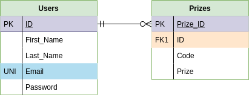

# GroupProject
# Prize Generator Application
A group project to fulfill the DevOps GMCA Project Specifications
 
## Index
* [Brief](#brief)
* [Solution](#solution)
* [User Stories](#user_stories)
* [Risk Assessment](#risks)
* [Kanban!](#kan)
* [Entity Relationship Diagrams](#erd)
* [Testing](#testing)
* [Deployment](#deployment)
* [User Web Interface](#UWI)
* [Relevant Information and Links](#rel)
 
 

## Brief
Our client has a requested our group to make a prize generator application. At the click of a button, the user will be presented on screen with a randomly generated code. The code must contain three randomly generated letters and six randomly created digits, for example hsy653471.
The generated code will be automatically tested to ensure that it meets the following conditionals:

•	If the first letter is an ‘a’ there is a 25% chance of winning £100 and 75% to win £50

The generated codes and their output (prize status) must be stored in a database. 

For services number 2, number 3 and number 4 we need to create two different implementations. We must be able to demonstrate swapping these implementations out for each other seamlessly, without disrupting the user experience. 

The application must run as four separate services that are inter-connected. This will allow the client to make any updates without the application being effected.  

## Solution
 
To provide a solution for our client we aim to utilise the supporting tools, technologies and methodologies covered during training in the academy. We will approach each area of the project with a DevOps mindset aiming to produce a high-quality application with clear communication and cooperation between the members of the group. For this we have decided the following:
 
* Adopt Agile methods to manage our project
* Perform risk assessment using the outline covered during the training
* Implement Kanban method using Trello
* Build database ERD using Draw.io
* Create Git repository to be our VCS
* Use MySQL server, HTML5, CSS3 , Python, Flask and a few more python modules  to build and test the application (refer to the requirements.txt for more details )
* Host the Application ( MySQL Database Server, Linux Web Application Server and Linux server hosting the automated deployment server for continuous integration ‘Jenkins’ ) on Google Cloud Platform ( free tier )
* Build containers for the separate micro-services that are part of the project
* Integrate automation where possible in line with the DevOps mindset 
* Test the application
* Deploy the application using an orchestration tool
 

## User Stories

## Risk Assessment

 

## Kanban Board
To create a back-log for the application and to also keep track of our progress while developing the application, we used Trello Board. It contained all the user stories and our To Do list. It gets updated regularly.
This was extremely useful for planning and managing our work as a team as we were completing the project by working remotely.

 
 

## Entity Relationship Diagrams
#### Initial ERD plan
 

