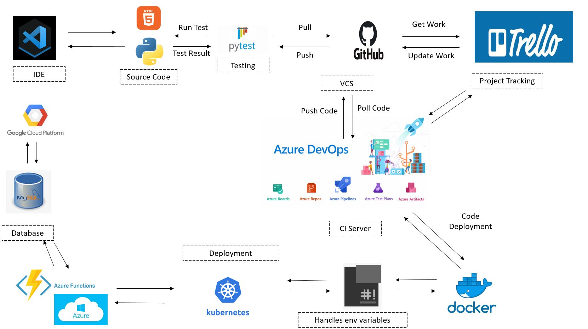
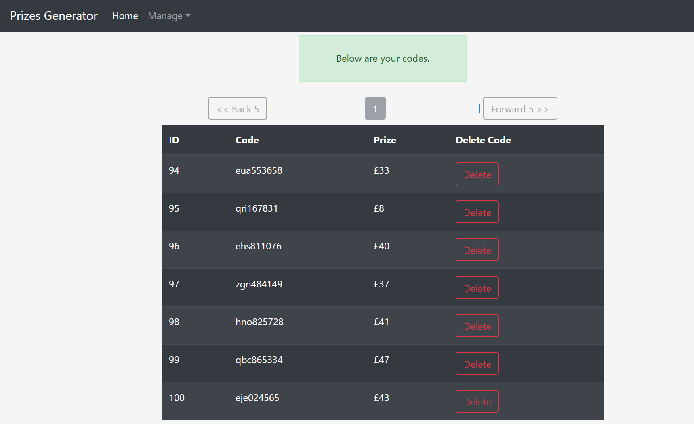

# GroupProject 
# Prize Generator Application
A group project to fulfill the DevOps GMCA Project Specifications
 
## Index
* [Brief](#brief)
* [Solution](#solution)
* [User Stories](#user_stories)
* [Risk Assessment](#risks)
* [Kanban!](#kan)
* [Entity Relationship Diagrams](#erd)
* [Testing](#testing)
* [Deployment](#deployment)
* [User Web Interface](#UWI)
* [Relevant Information and Links](#rel)
 
 

## Brief
Our client has a requested that our group create a prize generator application. 
At the click of a button, the user will be presented on screen with a randomly generated code. 
The code must contain three randomly generated letters and six randomly created digits, for example hsy653471.

The generated code will be automatically tested to ensure that it meets the following conditions:

•	If the first letter is an ‘a’ there is a 25% chance of winning £100, and 75% to win £50 otherwise.

The generated codes and their output (prize status) must be stored in a database. 

The application must run as four separate, yet inter-connected services.

For services number 2, number 3 and number 4 we need to create two different implementations. 

We must be able to demonstrate swapping these implementations out for each other seamlessly, without disrupting the user experience. 

This allows the client to make any updates without the application being effected.  

## Solution
 
To provide a solution for our client we aim to utilise the supporting tools, technologies and methodologies covered during training in the academy. We will approach each area of the project with a DevOps mindset aiming to produce a high-quality application with clear communication and cooperation between the members of the group. For this we have decided the following:
 
* Adopt Agile methods to manage our project
* Perform risk assessments using the outline covered during the training
* Implement Kanban method using Trello (later Projects on Azure DevOps).
* Build database ERD using Draw.io
* Create Git repository to be our VCS (subsequently migrated to Azure DevOps repo).
* Use MySQL server, HTML5, CSS3 , Python, Flask and a few more python modules  to build and test the application (refer to the requirements.txt for more details )
* Host the Application (MySQL Database Server, Linux Web Application Server and Linux server hosting the automated deployment server for continuous integration ‘Jenkins’ ) on Google Cloud Platform ( free tier )
* Build containers for the separate micro-services that are part of the project
* Integrate automation where possible in line with the DevOps mindset 
* Test the application
* Deploy the application using an orchestration tool
* Migrate the application to Azure DevOps CI Pipeline and orchestration tool for seamless rolling updates

## User Stories

## Risk Assessment

 

## Kanban Board
A regularly updated Trello board - see https://trello.com/b/EiUrPxd9/group-1-devops -  kept track of sprints, user stories, progress resolving issues and to-do list/task backlog. 

This was extremely useful for planning and managing our work as a geographically separated team as we were completing the project by working remotely.

 

## Entity Relationship Diagrams
#### Initial ERD plan
 

## Testing
The Testing for the application was done using pytest module. It tests the different microservices used for the application:
- the random number generator
- random text generator
- prize generator
- front-end prize generator page

### Number Generator

### Text Generator

### Prize Generator

### Front-end Prize Generator Page

Coverage for this is not 100% as it does not include login protected parts of the application.

## Deployment

To advance our skills and maximise the potential of available technologies we have deployed our application in two ways.

Firstly, we have used a Kubernetes Kluster. The application deployment is automated using a webhook from github to the CI server, Azure Devops Project. Whenever a commit is made to the master branch, the CI server is notified and it will grab a copy of the changes. The will trigger Docker to build the images and they will be deployed using Kubernetes as an orchestration tool. 

The diagram below displays the complexity of the CI/CD pipeline.

## User Web Interface
 
### Home Page without Login

 
### Registration Page

 
### Login Page

 
### Generate Code Page

### Stored Codes Page

### Manage Account Page

## Relevant information and links

* Application link IP address: http://20.185.78.213

* Trello Board Link: https://trello.com/b/EiUrPxd9/group-1-devops
